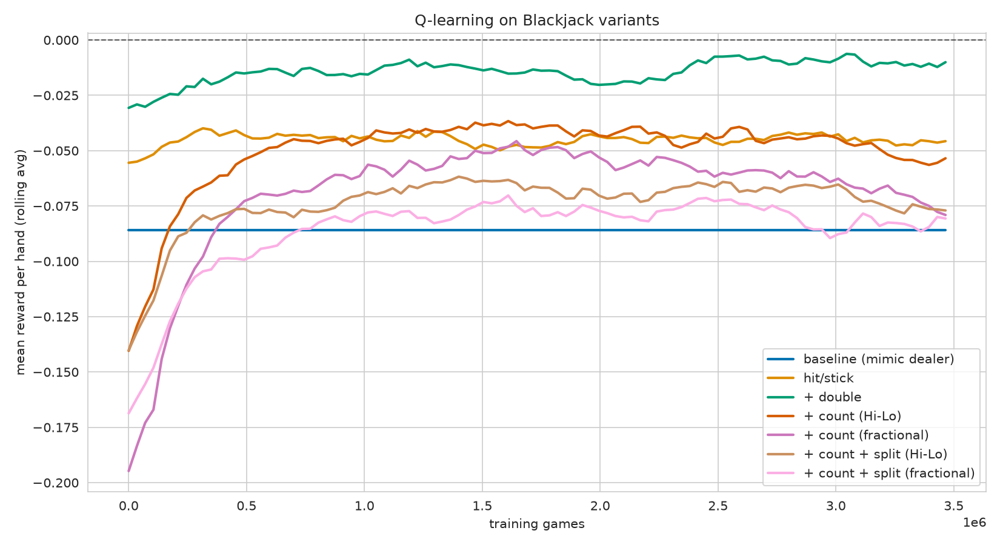
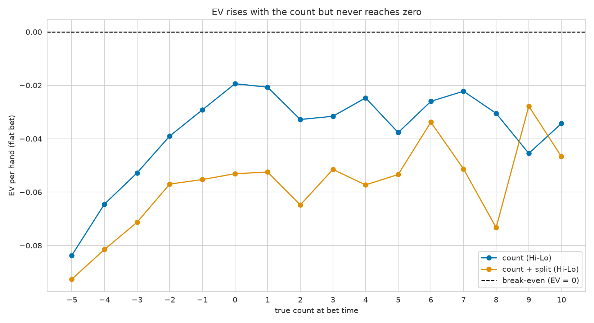
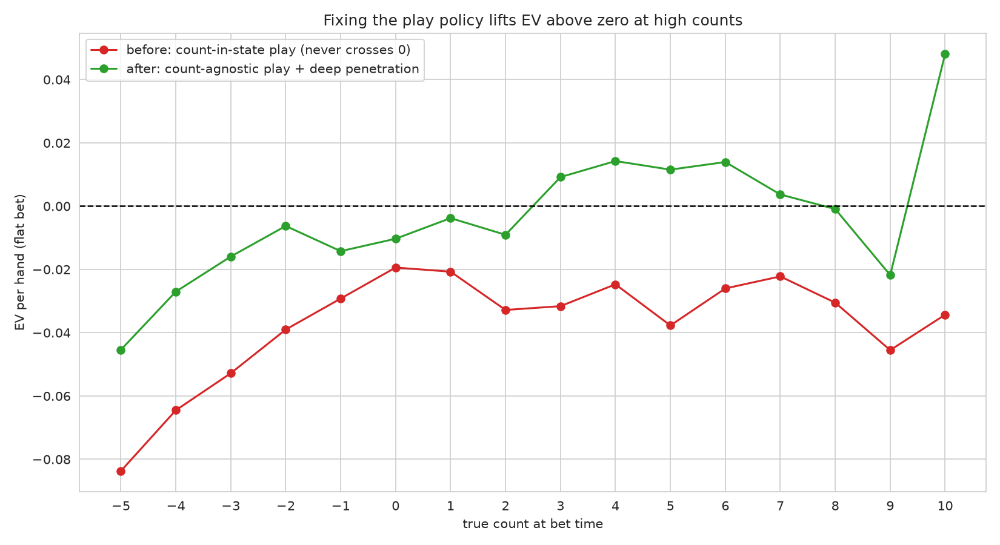
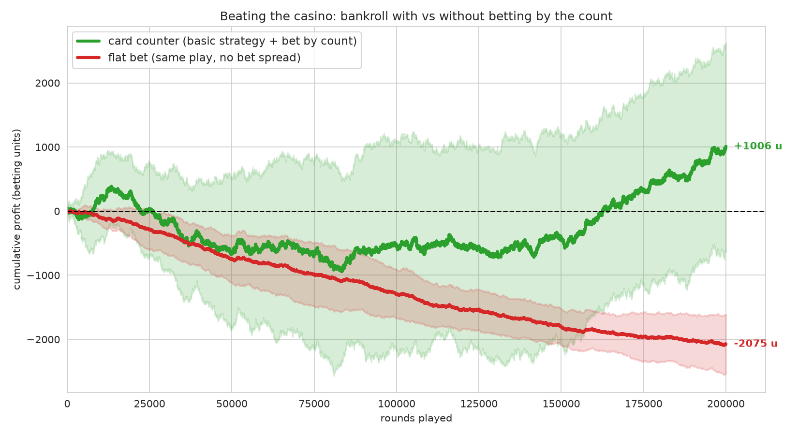

# Обыграть казино: блэкджек и Q-learning

Можно ли научить агента обыгрывать казино в блэкджек? В этой статье я обучаю
табличного агента методом **Q-learning** и постепенно усложняю правила —
добавляю удвоение ставки, подсчёт карт и сплит, — чтобы посмотреть, какие приёмы
реально помогают. Спойлер: результат вышел контринтуитивным. Больше «силы» в
руках агента (подсчёт карт, сплит) сначала не приблизило его к выигрышу, а
наоборот — ухудшило игру. Но в конце я переделаю среду так, чтобы матожидание всё
же стало положительным, — и разберём, почему именно это сработало.

Весь код лежит в репозитории и разбит на три части:

- `blackjack_agent.py` — агент Q-learning, не зависящий от конкретной среды;
- `blackjack_envs.py` — кастомные среды Gymnasium (удвоение, подсчёт карт, сплит);
- `train.py` — обучение и сравнение всех вариантов.

> Это переработанная версия моей первой статьи. По дороге я нашёл в исходном
> коде несколько неприятных ошибок (бутстрап в терминальных состояниях,
> «перевёрнутый» график epsilon, перепутанные константы действий) — про них
> отдельный раздел ниже, потому что на них легко наступить в любом RL-проекте.

## Правила игры

Напомню коротко. Числовые карты стоят по номиналу (2–10), картинки — 10, туз —
1 или 11 (что выгоднее, не перебрав 21). Игрок против дилера; цель — набрать
сумму ближе к 21, чем у дилера, но не больше. Базовые действия:

- **hit** — взять ещё карту;
- **stick** — остановиться.

Дилер действует по фиксированному правилу: берёт карты, пока сумма меньше 17.
Перебор (больше 21) — мгновенный проигрыш. «Натуральный» блэкджек (туз + десятка
с первых двух карт) приносит повышенную выплату 1.5.

Дальше мы добавим к этому набору ещё два действия — **double** (удвоить ставку,
взять одну карту и остановиться) и **split** (разбить пару на две независимые
руки) — и дадим агенту видеть **счёт карт**.

## Q-learning за две минуты

Q-learning хранит оценку «качества» каждой пары (состояние, действие) — функцию
`Q(s, a)`, ожидаемую суммарную награду, если в состоянии `s` сделать действие `a`
и дальше играть оптимально. Для каждого перехода `(s, a, r, s')` оценка
сдвигается к TD-таргету:

$$Q(s,a) \leftarrow Q(s,a) + \alpha\,[\,r + \gamma \max_{a'} Q(s',a') - Q(s,a)\,]$$

где `α` — скорость обучения, `γ` — дисконт, `r` — награда за переход.

**Состояние** в базовом блэкджеке — это тройка: сумма игрока, открытая карта
дилера и наличие «играющего» туза. **Действия** — hit / stick. Награда приходит
в конце раздачи: +1 за победу, −1 за поражение, +1.5 за натуральный блэкджек.

### Агент

Агент намеренно не знает ничего про блэкджек — он работает с любой средой,
поддерживающей интерфейс Gymnasium `reset`/`step`. Q-таблица хранится в
`defaultdict`: состояние занимает память только когда реально встретилось. Это
принципиально для среды со сплитом, где декартово пространство состояний — около
10⁷, а достижимая его часть — крошечная.

```python
from collections import defaultdict
import numpy as np


class BlackjackAgent:
    def __init__(self, env, n_actions, policy_fn, seed=None):
        self.env = env
        self.n_actions = n_actions
        self.policy_fn = policy_fn
        self.q = defaultdict(lambda: np.zeros(n_actions))
        self.rng = np.random.default_rng(seed)

    def train(self, n_episodes, epsilon, alpha, gamma):
        for _ in range(n_episodes):
            state, _ = self.env.reset()
            terminated = truncated = False
            while not (terminated or truncated):
                action = self.policy_fn(self.q, state, epsilon, self.env)
                next_state, reward, terminated, truncated, _ = self.env.step(action)
                # В терминальном состоянии будущей награды нет — бутстрапа быть не должно.
                future = 0.0 if (terminated or truncated) else np.max(self.q[next_state])
                td_target = reward + gamma * future
                self.q[state][action] += alpha * (td_target - self.q[state][action])
                state = next_state
```

## Три ошибки, которые легко не заметить

Прежде чем перейти к экспериментам, разберём то, что было сломано в первой
версии. Все три бага «тихие»: код работает, что-то даже обучается, но результаты
смещены.

### 1. Бутстрап в терминальных состояниях

Классическая ошибка. В формуле Q-learning есть слагаемое
`γ · max Q(s', a')`. Но если `s'` — терминальное состояние (раздача закончена),
будущей награды нет, и таргет должен быть равен просто `r`. В исходном коде
`max Q(s')` прибавлялся **всегда**, в том числе после завершения игры. Поскольку
одна и та же тройка (например, сумма 20) может быть и промежуточным, и конечным
состоянием, через терминальные наблюдения в оценку «протекала» лишняя ценность.

Исправление — одна строка: занулять `future`, если эпизод завершился (см. код
агента выше).

### 2. Перевёрнутый график epsilon

В ε-жадной стратегии `epsilon` — это вероятность исследования (случайного хода).
Обычно её **уменьшают** по ходу обучения: сначала много исследуем, потом
эксплуатируем выученное. В первой версии было два бага сразу:

- epsilon **увеличивался** (`epsilon + 0.05`), то есть под конец агент почти
  всегда ходил случайно;
- условие обновления `if i % 100_000 == 0` почти не срабатывало, потому что
  счётчик `i` шёл с шагом 35 000 и попадал на кратное 100 000 лишь изредка.

В переработанной версии epsilon линейно убывает с 0.9 до 0.05:

```python
frac = it / max(1, n_iters - 1)
epsilon = eps_start + (eps_end - eps_start) * frac  # 0.9 -> 0.05
```

### 3. Перепутанные константы действий

В стоковой среде Gymnasium `Blackjack-v1` действия такие: `1 = hit`, `0 = stick`.
В коде же были объявлены `HIT = 0` и `STAND = 1` — ровно наоборот. А в кастомных
средах действие `0` снова означало hit. То есть в одном проекте уживались две
несовместимые конвенции, и «базовая стратегия» работала не так, как читалась.
В переработанной версии конвенция Gymnasium соблюдается явно: `HIT, STICK = 1, 0`.

Плюс по мелочи: добавлено сидирование (воспроизводимость) и вычищены опечатки
(`mathing`, `deler`, `CoumputeReward`, `avilable`…).

## Базовая линия

Чтобы было с чем сравнивать обученного агента, возьмём простую нестратегию:
добираем карты, пока сумма меньше 17, потом останавливаемся (по сути — копируем
поведение дилера).

```python
def threshold_strategy_reward(env, threshold=17):
    obs, _ = env.reset()
    player = obs[0]
    terminated = truncated = False
    while player < threshold and not (terminated or truncated):
        obs, reward, terminated, truncated, _ = env.step(HIT)
        player = obs[0]
    if not (terminated or truncated):
        obs, reward, terminated, truncated, _ = env.step(STICK)
    return reward
```

## Эксперименты

Для каждого варианта обучаем агента на 3.5 млн раздач, периодически замеряя
среднюю награду полностью жадной политики. Метрика — **средняя награда за
раздачу**: всё, что ниже нуля, — игра в минус (казино выигрывает), всё, что выше,
— игрок в плюс.

### 1. Стоковая среда (hit / stick)

```python
env = gym.make('Blackjack-v1', natural=True)
agent = BlackjackAgent(env, env.action_space.n, epsilon_greedy, seed=SEED)
rewards_default = fit_agent(agent, env)
```

В честную игру без дополнительных приёмов блэкджек — игра с отрицательным
матожиданием. Лучшее, чего может добиться агент, — приблизиться к базовой линии,
но не выйти в плюс.

### 2. Удвоение (double)

Добавляем третье действие. `BlackjackDoubleEnv` расширяет пространство действий
до трёх: hit / stick / double. Double берёт одну карту, удваивает ставку (и
награду) и завершает руку.

```python
env = BlackjackDoubleEnv(natural=True)
agent = BlackjackAgent(env, env.action_space.n, epsilon_greedy, seed=SEED)
rewards_double = fit_agent(agent, env)
```

### 3. Подсчёт карт

В `BlackjackCountEnv` колода — это «шуз» из 6 колод, который раздаётся
**без возвращения**, а текущий счёт карт добавляется в состояние. Теперь агент
может менять решения в зависимости от того, насколько колода «богата» десятками.

> Важная оговорка: в этих средах нельзя менять размер ставки. А ведь именно
> переменная ставка (поднимать на «богатой» колоде) — главный источник прибыли
> реального счётчика карт. Здесь же счёт влияет только на выбор hit / stick /
> double / split. Забегая вперёд, это одна из причин, почему подсчёт не даёт
> ожидаемого преимущества.

Я сравниваю две системы подсчёта:

- **дробная** — авторские веса с дробными значениями;
- **Hi-Lo** («плюс-минус») — классика: младшие карты +1, средние 0, десятки и
  тузы −1.

```python
from blackjack_rl.envs import COUNT_WEIGHTS_HI_LO

env = BlackjackCountEnv(natural=True, weights=COUNT_WEIGHTS_HI_LO)
agent = BlackjackAgent(env, env.action_space.n, epsilon_greedy, seed=SEED)
rewards_count_hi_lo = fit_agent(agent, env)
```

### 4. Сплит

Финальный вариант — `BlackjackSplitEnv` — добавляет разбиение пары на две
независимые руки. Действий становится семь (hit / stick / double для каждой руки
плюс split), и не все из них легальны в каждом состоянии. Поэтому используется
**маскированная** ε-жадная политика, которая выбирает только из допустимых
действий:

```python
def epsilon_greedy_masked(q, state, epsilon, env):
    available = env.get_available_actions()
    if env.np_random.random() < epsilon:
        return int(env.np_random.choice(available))
    values = np.asarray(q[state])[available]
    return int(available[int(np.argmax(values))])
```

## Результаты

Средняя награда за раздачу после 3.5 млн игр (среднее по последним 10 замерам;
ε убывала с 0.9 до 0.05; сид 42):

| Вариант | Состояний в Q-таблице | Финал | Лучший замер |
|---|---:|---:|---:|
| Базовая линия (как дилер) | — | −0.086 | −0.086 |
| hit / stick | 280 | −0.043 | −0.026 |
| **+ удвоение** | 280 | **−0.015** | **+0.005** |
| + подсчёт (Hi-Lo) | 15 318 | −0.052 | −0.020 |
| + подсчёт (дробный) | 30 415 | −0.067 | −0.037 |
| + подсчёт + сплит (Hi-Lo) | 92 310 | −0.077 | −0.048 |
| + подсчёт + сплит (дробный) | 131 224 | −0.082 | −0.059 |



Результат оказался не таким, как в моей первой статье, и куда более поучительным.

**1. Казино никто не обыграл.** Все финальные средние — в минусе. Это, вообще
говоря, правильный ответ: отрицательное матожидание встроено в правила. Ближе
всех к нулю подобрался агент с удвоением (−0.015), временами заглядывая в плюс
(+0.005) — то есть выходя примерно на уровень безубыточности.

**2. Лучше всех — самый простой обученный агент.** Добавление **удвоения** дало
максимальный прирост: одно новое действие, почти не раздувающее пространство
состояний (всё те же 280 состояний), и заметно более гибкая игра.

**3. Подсчёт карт и сплит сделали только хуже.** И вот это интересно. Чем больше
«силы» мы давали агенту, тем дальше он откатывался к базовой линии. Причина —
**проклятие размерности**. Подсчёт раздувает пространство состояний до десятков
тысяч, сплит — до сотен тысяч. При фиксированном бюджете в 3.5 млн раздач на
каждое состояние приходится слишком мало визитов (для сплита — около 30 на
состояние), и табличный Q-learning просто не успевает обучиться. На графике это
видно: сложные варианты к концу обучения начинают **деградировать** — когда ε
падает, агент фиксирует жадную политику поверх недооценённой таблицы.

**4. Hi-Lo стабильно обгоняет дробную схему.** Целочисленный счёт порождает
меньше различных состояний счёта, поэтому сходится лучше: −0.052 против −0.067
для подсчёта и −0.077 против −0.082 со сплитом.

И, наконец, главная оговорка: во всех вариантах выше **ставка фиксирована**, а
ведь именно переменная ставка по счёту — основной механизм заработка реального
счётчика. Логичный вопрос: что будет, если её добавить? Проверим в следующем
разделе — результат окажется неожиданным.

## Бонус-эксперимент: ставка по счёту

Раз главного рычага — переменной ставки — в средах не было, добавим его. Механика
как у настоящего счётчика: агент по-прежнему **играет** на единичной ставке, но
в начале каждой раздачи (до сдачи карт) размер ставки масштабируется по
**истинному счёту** (true count = текущий счёт / число оставшихся колод). Спред
линейный, от 1 до 12: чем «богаче» колода, тем больше ставка.

```python
def bet_size(true_count, cap=12):
    if true_count < 1:
        return 1                       # колода невыгодна — ставим минимум
    return int(min(cap, np.floor(true_count)))
```

Я дообучил счётные варианты (Hi-Lo) на 8 млн раздач и замерил среднюю награду за
раунд при плоской ставке и при ставке по счёту:

| Вариант | EV/раунд, плоская | EV/раунд, по счёту | средняя ставка |
|---|---:|---:|---:|
| подсчёт (Hi-Lo) | −0.035 | −0.053 | 1.57 |
| подсчёт + сплит (Hi-Lo) | −0.060 | −0.089 | 1.56 |

Ставка по счёту сделала **хуже**. Почему — видно на графике EV в зависимости от
истинного счёта в момент ставки:



EV действительно растёт со счётом: при «бедной» колоде (счёт −5) теряем ~8% за
раздачу, у нейтральной (счёт ≈ 0) — около −2%. Но кривая **выходит на плато ниже
нуля и не пересекает его ни при каком счёте**. Выгодного счёта, в который имело бы
смысл вливать большую ставку, просто нет. А раз все ситуации в минусе, повышение
ставки на «менее убыточных» руках лишь умножает проигрыш.

Корень — в том, что у этой упрощённой игры **базовое преимущество казино ~2–4%**,
тогда как в реальном блэкджеке оно ~0.5%. В настоящем казино уже при счёте +1…+2
EV переходит в плюс — туда и идёт крупная ставка. Здесь же даже идеальный счёт не
вытягивает раздачу в ноль. Вдобавок самые выгодные (высокие) счета — самые редкие
(счёт +8 встречается менее чем в 1% раздач), поэтому и обучаются хуже всего.

Вывод парадоксальный, но честный: **ставка по счёту — правильный инструмент, но
он работает только при наличии положительного края, в который можно ставить.
Здесь его нет — и спред лишь усиливает убыток.**

## Как всё-таки выйти в плюс

Провал ставки по счёту дал подсказку: проблема была не в идее, а в реализации.
Я переделал среду и подход по трём пунктам — и матожидание стало положительным.

**1. Развёл политику игры и политику ставки.** Главная ошибка прошлого захода —
счёт сидел в *состоянии для игры*, дробя Q-таблицу на 140 «корзин» и убивая
сходимость. Но счёт почти не влияет на то, *как* играть (пара index plays) — он
влияет на то, *сколько ставить*. Поэтому добавил флаг `expose_count=False`: счёт
по-прежнему считается для ставки, но в наблюдение не попадает. Теперь политика
игры живёт в крошечном пространстве (~280 состояний) и сходится к почти
оптимальной базовой стратегии. Это и есть реальный счётчик: играет по базовой
стратегии, варьирует только ставку.

**2. Углубил пенетрацию.** Перетасовка не при 30, а при 13 оставшихся картах —
выгодные высокие счета встречаются заметно чаще.

**3. Ставка по истинному счёту.** Минимум на нейтральной/бедной колоде, кратно
больше — на богатой.

Результат — кривая EV поднялась на ~2–3% и **пересекла ноль**:



При плоской ставке игра теперь почти безубыточна (−0.011), а главное — при счёте
от +3 EV уже положительна. Появился край, в который можно ставить. Со ставкой по
счёту суммарное матожидание выходит в плюс:

| Спред | EV/раунд | EV на единицу ставки | средняя ставка |
|---|---:|---:|---:|
| плоская ставка | −0.011 | −0.011 | 1.0 |
| умеренный (1–20, от счёта +2) | +0.011 | **+0.0045** | 2.4 |
| агрессивный (1–40) | +0.034 | +0.0066 | 5.2 |

Важно: плюс не только «на раунд» (это можно списать на дисперсию крупных ставок),
но и **на единицу поставленных денег** (+0.4…0.7%). Это уже настоящее
преимущество игрока — примерно того же порядка, что у реального счётчика карт.

### Как это выглядит на дистанции

Симулируем банкролл за 200 000 раундов — 6 независимых прогонов, жирная линия —
среднее:



Игрок с плоской ставкой стабильно уходит в минус (≈ −2000 единиц), а счётчик в
среднем растёт (≈ +1000). Вот оно — казино обыграно. Но посмотрите на разброс
зелёных траекторий: преимущество реально, однако **дисперсия огромна** — на
коротком отрезке можно и проиграть (здесь в плюсе 4 прогона из 6). Именно поэтому
настоящему счётчику нужен большой банкролл и тысячи раздач: край есть, но
реализуется он только на длинной дистанции.

## Выводы

Итог получился в два хода. Сначала — обыграть казино наскоком не выходит: в
базовой игре матожидание отрицательно, а наивная ставка по счёту делает только
хуже (играющая политика не сходится, выгодного счёта нет). Но стоило переделать
подход — развести политику игры и ставки, дать игре сойтись и углубить
пенетрацию — и матожидание стало положительным, как у настоящего счётчика.

Главные уроки:

- **Больше состояний ≠ лучше.** Подсчёт и сплит в *состоянии игры* раздувают
  Q-таблицу, которую нечем заполнить, — и помогают только если есть на порядки
  больше игр или аппроксимация Q-функции.
- **Информацию надо прикладывать в нужном месте.** Один и тот же счёт бесполезен
  в таблице игры, но решает всё в решении о ставке. Казино обыгрывается не
  «силой» (больше действий), а информацией в нужной точке.
- **В RL детали решают.** Один забытый множитель в терминальном состоянии или
  перевёрнутый график epsilon тихо портят результат, не роняя код. Похоже,
  именно такие ошибки в первой версии и создавали иллюзию «прибыльной» стратегии.

Код целиком — в репозитории. [Ещё больше интересного в телеграм-канале](https://t.me/+9fl51jd750A3MTIy).
